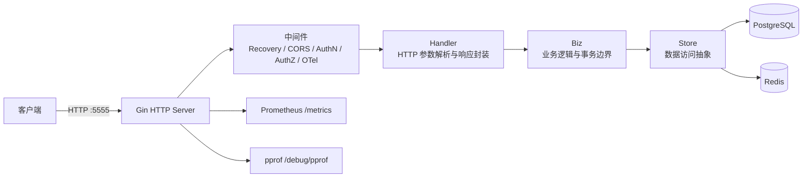

# gin-enterprise-template

`gin-enterprise-template` 是一个基于 Go 1.25+、Gin、GORM、JWT、Casbin 与 OpenTelemetry 的企业级后端 API skeleton。项目以整洁架构、模块化分层、可观测性和可复制的工程规范为核心，当前提供 `gin-enterprise-template-apiserver` 一个后端服务。

## 安全提示

仓库中的配置文件只保留模板占位值，首次在任何环境运行前都必须替换敏感配置：

- `jwt.secret`：必须是至少 32 字符的随机字符串，可用 `openssl rand -hex 32` 生成；
- `postgresql.password`：替换为当前数据库真实密码；
- `redis.password`：替换为当前 Redis 真实密码；
- 生产环境不要提交包含真实密钥、密码或证书的配置文件。

程序启动时会校验空值、默认值和弱 JWT secret，不满足要求会直接拒绝运行。

## 功能特性

- Web 框架：基于 Gin 提供 RESTful API；
- 数据访问：基于 GORM 访问 PostgreSQL，支持 Redis；
- 认证授权：JWT Access Token / Refresh Token 与 Casbin RBAC；
- 权限模型：支持用户、角色、权限、菜单和菜单树；
- 可观测性：OpenTelemetry、Prometheus `/metrics`、结构化 `slog` 日志；
- 诊断能力：健康检查 `/healthz` 与 pprof `/debug/pprof/`；
- 工程化：Makefile、Dockerfile、Protobuf、Wire、golangci-lint；
- 测试能力：单元测试、覆盖率检查、竞态检测、基准测试入口。

## 系统架构



| 层级 | 目录 | 职责 |
|------|------|------|
| Handler | `internal/apiserver/handler/` | HTTP 请求绑定、校验、响应封装与路由注册 |
| Biz | `internal/apiserver/biz/` | 业务编排、事务边界、领域规则 |
| Store | `internal/apiserver/store/` | 数据访问接口与 GORM 操作封装 |
| Model | `internal/apiserver/model/` | 数据库模型定义 |
| pkg | `pkg/` | 可复用基础库、API 定义、配置选项、认证授权等 |

依赖注入入口：`internal/apiserver/wire.go` 与生成文件 `internal/apiserver/wire_gen.go`。

## 目录结构

```text
gin-enterprise-template/
├── api/                         # OpenAPI 等生成产物
├── build/docker/                # Docker Compose 清单
├── cmd/                         # 应用入口
│   └── gin-enterprise-template-apiserver/
├── configs/                     # 运行配置与 OTEL Collector 配置
├── docs/                        # 功能文档
├── internal/apiserver/          # apiserver 业务代码
│   ├── biz/
│   ├── handler/
│   ├── model/
│   ├── pkg/
│   └── store/
├── pkg/                         # 可复用公共包与 API 定义
├── scripts/                     # 构建与辅助脚本
├── third_party/                 # 第三方 proto 等依赖
├── web/                         # 前端或管理端预留目录
├── docker-compose.env.yml       # 本地依赖服务 Compose
├── Dockerfile                   # 应用镜像构建文件
├── Makefile
├── go.mod
└── README.md
```

## 环境要求

| 工具 | 版本 / 说明 |
|------|-------------|
| Go | `1.25.3` 或更高版本 |
| Git | 用于版本控制 |
| Make | 用于统一构建、测试、代码生成 |
| Docker / Docker Compose | 可选，用于启动依赖服务和构建镜像 |
| golangci-lint | 可选，用于静态检查 |
| protoc 及插件 | 可通过 `make deps` 安装 |

## 快速开始

### 1. 安装依赖并生成代码

```bash
make deps
make tidy
make protoc
make generate
```

### 2. 准备运行配置

默认配置文件是：

```text
configs/gin-enterprise-template-apiserver.yaml
```

至少需要更新以下字段：

```yaml
jwt:
  secret: "请替换为至少 32 字符随机字符串"

postgresql:
  addr: 127.0.0.1:5432
  database: template
  username: postgres
  password: "请替换为数据库密码"

redis:
  addr: 127.0.0.1:6379
  password: "请替换为 Redis 密码"
```

如果使用 `docker-compose.env.yml` 启动本地依赖服务，宿主机端口与默认配置不同，需要同步调整：

| 服务 | Compose 容器端口 | 宿主机端口 | Compose 默认凭据 |
|------|------------------|------------|------------------|
| PostgreSQL | `5432` | `54321` | `postgres / postgres`，数据库 `template` |
| Redis | `6379` | `56379` | 密码 `CHANGE_ME_REDIS_PASSWORD` |
| OTEL Collector gRPC | `4327` | `4327` | 无 |
| OTEL Collector HTTP | `4328` | `4328` | 无 |
| OTEL Collector Health | `13133` | `13133` | 无 |

### 3. 启动本地依赖服务

```bash
docker compose -f docker-compose.env.yml up -d
```

### 4. 构建并运行服务

```bash
make build BINS=gin-enterprise-template-apiserver

_output/platforms/$(go env GOOS)/$(go env GOARCH)/gin-enterprise-template-apiserver \
  --config configs/gin-enterprise-template-apiserver.yaml
```

服务默认监听：

```text
http://localhost:5555
```

### 5. 验证服务

```bash
curl -i http://localhost:5555/healthz
curl -i http://localhost:5555/metrics
curl -i http://localhost:5555/debug/pprof/
```

## 常用 Make 命令

| 命令 | 说明 |
|------|------|
| `make all` | 执行 `deps protoc tidy format generate build cover` |
| `make deps` | 安装构建、Protobuf、代码生成等开发工具 |
| `make tidy` | 执行 `go mod tidy` |
| `make protoc` | 编译 Protobuf，并生成 OpenAPI 产物到 `api/openapi/` |
| `make generate` | 执行 `go generate ./...` |
| `make build` | 构建当前平台所有二进制 |
| `make build BINS=gin-enterprise-template-apiserver` | 构建 apiserver |
| `make build.multiarch` | 构建多平台二进制 |
| `make test` | 执行单元测试、覆盖率、race 检测和 shuffle |
| `make cover` | 执行测试并检查覆盖率阈值 |
| `make lint` | 执行 golangci-lint 静态检查 |
| `make format` | 执行 `gofmt -s -w ./` |
| `make clean` | 删除 `_output/` 构建产物 |
| `make help` | 查看 Makefile 帮助 |

构建产物默认输出到：

```text
_output/platforms/<GOOS>/<GOARCH>/gin-enterprise-template-apiserver
```

## Docker 使用说明

当前仓库的应用 `Dockerfile` 位于项目根目录。

```bash
docker build \
  --build-arg OS=linux \
  --build-arg ARCH=amd64 \
  -f Dockerfile \
  -t gin-enterprise-template/gin-enterprise-template-apiserver:latest \
  .
```

应用容器的 Compose 清单位于：

```text
build/docker/gin-enterprise-template-apiserver/docker-compose.yml
build/docker/gin-enterprise-template-apiserver/docker-compose.prod.yml
```

使用这些 Compose 清单前，请先确认：

- 配置文件已准备好，并挂载到容器内的 `/app/configs/gin-enterprise-template-apiserver.yaml`；
- `jwt.secret`、数据库密码和 Redis 密码已经替换；
- Compose 中引用的 Dockerfile 路径与当前仓库实际路径一致。

## 关键配置

当前主要配置文件：

| 文件 | 用途 |
|------|------|
| `configs/gin-enterprise-template-apiserver.yaml` | apiserver 本地运行配置 |
| `configs/otel-collector.yaml` | OTEL Collector 配置 |
| `docker-compose.env.yml` | 本地 PostgreSQL、Redis、OTEL Collector 依赖服务 |
| `Dockerfile` | 应用镜像构建文件 |
| `build/docker/gin-enterprise-template-apiserver/docker-compose.yml` | 应用容器开发 Compose 清单 |
| `build/docker/gin-enterprise-template-apiserver/docker-compose.prod.yml` | 应用容器生产 Compose 清单 |

核心配置示例：

```yaml
http:
  addr: 0.0.0.0:5555
timeout: 30s

jwt:
  secret: ""
  access-expiration: 2h
  refresh-expiration: 168h

postgresql:
  addr: 127.0.0.1:5432
  database: template
  username: postgres
  password: ""
  max-idle-connections: 100
  max-open-connections: 1000

redis:
  addr: 127.0.0.1:6379
  username: ""
  password: ""
  database: 0
  pool-size: 10

otel:
  endpoint: 127.0.0.1:4327
  service-name: gin-enterprise-template-apiserver
  output-mode: classic
  level: debug
  add-source: true
  use-prometheus-endpoint: true
```

`otel.output-mode` 支持：`otel`、`console`、`file`、`classic`、`hybrid`。

## API 概览

通用接口：

| 方法 | 路径 | 说明 |
|------|------|------|
| `GET` | `/healthz` | 健康检查 |
| `GET` | `/metrics` | Prometheus 指标 |
| `GET` | `/debug/pprof/` | pprof 入口 |

认证接口：

| 方法 | 路径 | 说明 |
|------|------|------|
| `POST` | `/v1/auth/login` | 用户登录，返回 Access Token 与 Refresh Token |
| `PUT` | `/v1/auth/refresh-token` | 使用 Refresh Token 刷新令牌 |

用户与 RBAC 接口：

| 资源 | 路径 | 能力 |
|------|------|------|
| 用户 | `/v1/users`、`/v1/users/:userID` | 创建、查询、更新、删除、列表 |
| 用户密码 | `/v1/users/:userID/change-password` | 修改密码 |
| 用户角色 | `/v1/users/:userID/roles`、`/v1/users/:userID/roles/:roleID` | 分配、查询、移除角色 |
| 用户菜单 | `/v1/users/menu-tree` | 获取当前用户可见菜单树 |
| 角色 | `/v1/roles`、`/v1/roles/:roleID` | 创建、查询、更新、删除、列表 |
| 角色权限 | `/v1/roles/:roleID/permissions` | 分配和查询角色权限 |
| 权限 | `/v1/permissions`、`/v1/permissions/:permissionID` | 创建、查询、更新、删除、列表 |
| 权限树 | `/v1/permissions/tree` | 获取权限树 |
| 菜单 | `/v1/menus`、`/v1/menus/:menuID` | 创建、查询、更新、删除、列表 |
| 菜单树 | `/v1/menus/tree` | 获取菜单树 |

除创建用户、登录、刷新令牌等开放接口外，业务资源接口会经过 JWT 认证和 Casbin 授权中间件。

## API 调试示例

创建用户：

```bash
curl -X POST http://localhost:5555/v1/users \
  -H "Content-Type: application/json" \
  -d '{
    "username": "testuser",
    "password": "Test@123",
    "email": "test@example.com",
    "phone": "13800138000"
  }'
```

登录：

```bash
curl -X POST http://localhost:5555/v1/auth/login \
  -H "Content-Type: application/json" \
  -d '{
    "username": "testuser",
    "password": "Test@123"
  }'
```

带 Token 访问受保护接口：

```bash
curl http://localhost:5555/v1/users \
  -H "Authorization: Bearer <access-token>"
```

## 可观测性

- Gin 全局接入 OpenTelemetry 中间件；
- `/metrics` 暴露 Prometheus 指标，并从 Trace 中排除该路径；
- `/debug/pprof/` 提供运行时诊断入口；
- 日志使用结构化 `slog`，可通过 `otel.slog` 配置输出格式和位置；
- `configs/otel-collector.yaml` 提供本地 OTEL Collector 配置。

常用检查命令：

```bash
curl http://localhost:5555/metrics
curl http://localhost:5555/debug/pprof/
docker logs gin-enterprise-template-otel-collector
```

## 测试与质量检查

```bash
make test
make cover
make lint
go test -bench=. ./...
```

项目推荐表格驱动测试，并在涉及并发时显式处理竞态风险。

## 文档索引

当前仓库内已有文档：

- [User 模块业务逻辑文档](docs/features/01%20user.md)
- [RBAC 权限管理系统](docs/features/02%20permision.md)

## 常见问题

### 启动时报 JWT secret 错误

检查 `configs/gin-enterprise-template-apiserver.yaml` 中的 `jwt.secret`，确保它非空、不是默认占位值，并且长度不少于 32 字符。

### 本地二进制无法连接数据库或 Redis

如果依赖服务由 `docker-compose.env.yml` 启动，请确认本地配置使用宿主机映射端口：PostgreSQL `127.0.0.1:54321`，Redis `127.0.0.1:56379`，并同步 Compose 中的密码。

### Docker Compose 找不到配置或 Dockerfile

当前根目录存在 `Dockerfile`，应用 Compose 清单位于 `build/docker/gin-enterprise-template-apiserver/`。使用前请确认 Compose 中的 `dockerfile` 与 `volumes` 路径指向当前仓库中真实存在的文件。

### 端口冲突

```bash
lsof -i :5555
```

如需更换监听端口，请修改 `configs/gin-enterprise-template-apiserver.yaml` 中的 `http.addr`。
