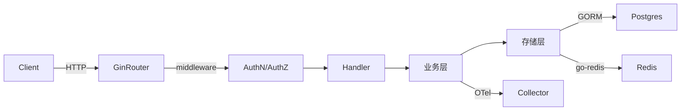

# gin-enterprise-template 调整清单

> 本文档由架构师评审生成，列出该模板作为「通用 Go 企业级 Gin 脚手架」当前存在的问题及优化建议，按优先级分组。
>
> 评审时间：2026-04-25
> 最近更新：2026-04-28（5 项 P0 全部修复，详见下方「修复进度」）
> 评审范围：整个项目（cmd/internal/pkg/configs/Dockerfile/Makefile/README/golangci.yaml/.git 之外的所有源码与配置）

---

## 修复进度（2026-04-28 更新）

| # | 问题 | 状态 | 关键提交点 |
|---|------|------|-----------|
| #1 | 硬编码密钥 | ✅ 已修复 | `configs/*.yaml` 改为占位符 + `.env.example` + viper AutomaticEnv |
| #2 | 端口不一致 | ✅ 已修复 | 全部统一为 `5555`（README + build/docker/*.yml + Dockerfile + configs） |
| #3 | 配置文件命名 | ✅ 已修复 | 重命名为 `configs/gin-enterprise-template-apiserver.yaml`；`searchDirs()` 加入 `./configs` |
| #4 | service name 硬编码 | ✅ 已修复 | `Config` 增加 `OTelOptions`；`httpserver.go` 通过 `c.resolveServiceName()` 读取 |
| #5 | defaultHomeDir 硬耦合 | ✅ 已修复 | 通过 `computeBinaryName()` 从 `os.Args[0]` 动态推导 |
| #13 | Dockerfile HEALTHCHECK | ✅ 已修复 | 已添加 HEALTHCHECK 指令 |
| #16 | `.env.example` | ✅ 已修复 | 已生成完整模板 |
| 其他 | #6/#7/#8/#9/#10/#11/#12/#14/#15/#17/#18/#19/#20 | ⏳ 未处理 | 见下方各章节 |

---

## 总览

| 类别 | 数量 | 关键代表 |
|------|------|---------|
| 🔴 严重（安全 / 正确性） | 5 项 | 硬编码密钥、端口三不一致、配置命名混乱、service name 多处硬编码 |
| 🟡 中等（设计 / 架构） | 7 项 | Wire / 手动 DI 并存、CRUD 重复、proto/grpc 死代码、metrics 双系统 |
| 🟢 低（DX / 工程化） | 8 项 | HEALTHCHECK、.env.example、FORK-CHECKLIST、README 缺架构图 |
| **合计** | **20 项** | |

## 优先处理 Top 5

1. **#1 硬编码密钥** — 安全 P0，必须立即修复
2. **#2 端口三不一致** — 用户上手必踩坑
3. **#3 配置文件名混乱** — 用户启动失败的根因
4. **#4 + #5 service name 硬编码** — 让模板真正可复用
5. **#11 + #12 README 加架构图 + 默认覆盖率门槛** — 提升模板教学价值

---

## 🔴 严重问题（5 项）

### #1 硬编码密钥泄漏（Critical 安全风险）

**位置**：`configs/configs.yaml`

```yaml
jwt:
  secret: 9NJE1L0b4Vf2UG8IitQgr0lw0odMu0y8 # 真实密钥写死在 git 历史里
postgresql:
  password: 2eVHeXDmZ5nTDiPb
redis:
  password: Q6jAu8trwDEcJN7V
```

**问题**：
- 所有 fork 此模板的项目共享相同 JWT secret，可伪造任意用户的 token
- 数据库 / Redis 密码暴露给所有人
- 部署到生产时若忘改，会被自动化扫描器在分钟内攻陷

**改进方案**：

1. 配置文件改为占位符 + 环境变量替换：
   ```yaml
   jwt:
     secret: ${JWT_SECRET}
   postgresql:
     password: ${PG_PASSWORD}
   ```
2. 提供 `configs/configs.yaml.example`，把 `configs/configs.yaml` 加入 `.gitignore`
3. 启动时增加默认值校验：
   ```go
   if cfg.JWT.Secret == "" || cfg.JWT.Secret == "9NJE1L0b4Vf2UG8IitQgr0lw0odMu0y8" {
       return errors.New("must set a secure JWT_SECRET (minimum 32 chars)")
   }
   if len(cfg.JWT.Secret) < 32 {
       return errors.New("JWT_SECRET must be at least 32 characters")
   }
   ```
4. README 顶部用红字警告："首次部署必须替换所有默认密钥（参考 `configs.yaml.example`）"

---

### #2 端口号配置三处不一致

| 来源 | 端口 |
|---|---|
| `configs/configs.yaml` | `5557` |
| `README.md` 启动说明 | `5555` |
| `Dockerfile EXPOSE` | `5556` |

**问题**：用户按 README 启动，curl `http://localhost:5555/healthz` 必失败。

**改进**：统一为 `5555`（推荐，与 README 对齐），同步更新 `configs.yaml` 与 `Dockerfile EXPOSE`。

---

### #3 配置文件命名混乱

| 来源 | 期望的配置文件名 |
|---|---|
| `configs/configs.yaml` | `configs.yaml` |
| `cmd/.../app/server.go` 的 `defaultConfigName` | `gin-enterprise-template-apiserver.yaml` |
| `README.md` 启动示例 | `configs/gin-enterprise-template-apiserver.yaml` |
| forge 替换后 | `<service>-apiserver.yaml` 但 `configs.yaml` 仍叫旧名 |

**问题**：用户启动时找不到默认配置，必须显式 `-c configs/configs.yaml`。

**改进**：约定单一命名 `configs/<service-name>.yaml`：
- 重命名 `configs/configs.yaml` → `configs/gin-enterprise-template-apiserver.yaml`
- 让 forge 的 `renames` 规则把它改为 `<demo-api>-apiserver.yaml`
- 所有引用同步

---

### #4 service name 在 .go 源码中多处硬编码

**位置**：`internal/apiserver/httpserver.go`

```go
otelgin.Middleware("gin-enterprise-template-apiserver", ...)
_ = metrics.Initialize(context.Background(), "gin-enterprise-template-apiserver")
```

**问题**：作为通用模板，service name 不应该是字面常量。当前只是因为 forge 的字符串替换覆盖了这些位置，纯 fork 用户必须 grep 替换。

**改进**：从 `cfg.OTelOptions.ServiceName` 读取：

```go
func (c *ServerConfig) NewGinServer() (*ginServer, error) {
    serviceName := c.OTelOptions.ServiceName // 从配置读
    engine.Use(
        ...,
        otelgin.Middleware(serviceName, otelgin.WithFilter(...)),
        ...,
    )
}

func InstallGenericAPI(engine *gin.Engine, serviceName string) {
    _ = metrics.Initialize(context.Background(), serviceName)
    ...
}
```

---

### #5 `defaultHomeDir` 与项目名硬耦合

**位置**：`cmd/gin-enterprise-template-apiserver/app/server.go`

```go
const (
    defaultHomeDir    = ".gin-enterprise-template"
    defaultConfigName = "gin-enterprise-template-apiserver.yaml"
)
```

**问题**：fork 用户必须改这两个常量，否则配置文件查找路径错乱。

**改进**：从 `os.Args[0]` 推导：

```go
var (
    defaultHomeDir    = "." + filepath.Base(os.Args[0])
    defaultConfigName = filepath.Base(os.Args[0]) + ".yaml"
)
```

或用 ldflags 注入：

```bash
go build -ldflags "-X main.defaultHomeDir=.${SERVICE_NAME}"
```

---

## 🟡 中等问题（7 项）

### #6 Wire DI 与手动 NewServer 并存

**位置**：
- `internal/apiserver/wire.go` + `wire_gen.go`（自动生成的 DI）
- `internal/apiserver/server.go` 又有手动 `NewServer(cfg)` + `NewWebServer(serverConfig)`

**问题**：两套构造路径并存，新人维护时不知道在哪里加依赖；可能出现 DI 与手动 New 不同步。

**改进**：选择一种统一：
- 推荐**全 Wire**：删除 server.go 中的 `NewServer/NewWebServer`，所有依赖通过 Wire 提供
- 或全手动：删除 wire.go 与 wire_gen.go

### #7 CRUD 重复代码严重

**目录**：`internal/apiserver/biz/v1/{user,role,menu,permission,user_role}/`

5 个资源 × 5 个操作 = **25 个文件**，模板代码极为相似（只是类型不同）。

**改进**：使用 Go 1.18+ 泛型抽出 `BaseCRUDBiz[T any, CreateReq any, ListReq any]`，减少 70-80% 样板。各资源仅实现自己特殊的业务逻辑（如 user 的密码哈希、role 的权限关联）。

### #8 proto / gRPC 接口定义存在但未启动 gRPC server

**位置**：`pkg/api/apiserver/v1/apiserver_grpc.pb.go` 生成了 gRPC service 定义，但 `internal/apiserver/httpserver.go` 只起 HTTP server。

**问题**：误导用户以为支持 gRPC，但实际没有 gRPC listener。

**改进**：二选一：
- 在 `server.go` 真正启动 gRPC server（README 也提到了 grpc）
- 删除所有 gRPC 相关 proto / pb.go / 生成脚本，避免死代码

### #9 metrics 双系统并存

引入了 `prometheus/client_golang` 与 `go.opentelemetry.io/otel/metric`。两套 metrics 系统采集相同数据可能造成 cardinality 爆炸 / 数据重复。

**改进**：只保留一种，推荐 OTel + OTel Collector → Prometheus exporter（业界标准方向）。

### #10 golangci.yaml 4141 行 + `default: all`

```yaml
linters:
  default: all
  enable:
    - arangolint
    - asasalint
    - ...（100+ 项）
```

**问题**：启用了几乎所有 linter，对模板使用者来说太严苛——很难写出一段能通过的代码，违背"开箱即用"。

**改进**：减到合理子集（标准 + 5-10 个高价值 linter）：
```yaml
linters:
  default: standard
  enable:
    - errcheck
    - gosec
    - gocritic
    - revive
    - bodyclose
    - errorlint
    - prealloc
```

### #11 测试覆盖率门槛 = 1（实际上没有测试）

```makefile
COVERAGE := 1  # production 应该 60，但模板默认就摆烂
```

**改进**：
- 提供至少 30% 的测试示例（biz/store/handler 各一个完整测试用例）
- `COVERAGE := 30` 作为 baseline
- README 说明"建议生产环境 ≥ 60%"

### #12 README 437 行但没有架构图

**问题**：README 充斥大量 `docker compose` / `kubectl` 命令清单，但缺：
- 整体架构数据流图（`HTTP → router → middleware → handler → biz → store → DB`）
- 模块依赖图
- 哪些 pkg 是核心、哪些可选

**改进**：在 README 顶部加 mermaid 架构图：



---

## 🟢 低优先级（8 项）

### #13 Dockerfile 缺 HEALTHCHECK

```dockerfile
FROM scratch AS runtime
...
EXPOSE 5556
ENTRYPOINT ["/app/gin-enterprise-template-apiserver"]
```

**改进**：

```dockerfile
HEALTHCHECK --interval=30s --timeout=3s --start-period=10s --retries=3 \
    CMD ["/app/gin-enterprise-template-apiserver", "healthcheck"] || exit 1
```

或在应用层暴露 `/healthz` 给外部 probe（k8s 已 OK，但 docker swarm 需 HEALTHCHECK）。

### #14 Dockerfile 多阶段优化空间

- `runtime` 用 `FROM scratch` 但注释了 CA 证书 copy — 如果应用要发 HTTPS 请求会失败
- ARG 里写了 `RUNTIME_IMAGE=gcr.io/distroless/base-debian12:nonroot` 但 Dockerfile 实际用 `FROM scratch`

**改进**：要么用 distroless（推荐），要么 scratch + 必须 COPY CA 证书。

### #15 README 中危险命令未警告

`docker image prune`、`docker rmi` 未提醒风险，新手可能误操作清掉重要镜像。

**改进**：加 `> ⚠️ 注意：以下命令会删除未被使用的镜像，生产环境慎用` 提示。

### #16 缺 .env.example

环境变量约定全靠 README 描述，没有可复制的示例文件。

**改进**：提供 `.env.example`：
```bash
# JWT
JWT_SECRET=                       # 必填，至少 32 字符
JWT_ACCESS_EXPIRATION=2h
JWT_REFRESH_EXPIRATION=168h

# PostgreSQL
PG_HOST=127.0.0.1
PG_PORT=5432
PG_DATABASE=template
PG_USERNAME=postgres
PG_PASSWORD=                      # 必填

# Redis
REDIS_ADDR=127.0.0.1:6379
REDIS_PASSWORD=

# OTel
OTEL_ENDPOINT=127.0.0.1:4327
OTEL_SERVICE_NAME=gin-enterprise-template-apiserver
```

### #17 缺 CHANGELOG.md 与 LICENSE

模板项目应包含这些标准文件作为示例。LICENSE 推荐 MIT 或 Apache-2.0。

### #18 forge 模板集成约定缺失

- 模板根目录没有 `meta.json`（被 forge 的 `dist/defaults/templates/web-gin-proto.json` 替代）
- 没有 `template/` 子目录约定（forge 在 `cli/commands/create.ts` 里有 hack 代码自动把所有文件移到 `template/`）

**改进**：模板自身组织：
```
gin-enterprise-template/
├── meta.json                # 模板元数据（forge 直接读）
└── template/                # 实际项目文件
    ├── cmd/
    ├── internal/
    └── ...
```

### #19 缺 docs/FORK-CHECKLIST.md

模板使用者 fork 后必须手动改：
- [ ] `configs/configs.yaml` 中的所有密码与密钥
- [ ] `cmd/<service>-apiserver/app/server.go` 中的 `defaultHomeDir` / `defaultConfigName`
- [ ] `internal/apiserver/httpserver.go` 中的 service name
- [ ] `Makefile` 中的 `ROOT_PACKAGE`、`REGISTRY_PREFIX`
- [ ] `Dockerfile` 中的 `EXPOSE` 端口（与 configs 对齐）
- [ ] `README.md` 中的项目名 / 团队信息
- [ ] `LICENSE` 中的版权信息
- [ ] `go.mod` 的 module path

forge 用户由 forge 自动处理大部分，但纯 fork 用户没有指引。

### #20 所有 .go 文件中 `github.com/clin211/gin-enterprise-template` 的引用

被 forge 的 `replacements` 规则处理，但**模板自身**不应该有 owner-specific 路径。

**改进**：模板源码用 `MODULE_PATH` 占位符，配合 forge 的变量插值在生成时替换。

---

## 修复路线建议

### Sprint 1（安全与基础正确性，1 周）

- #1 硬编码密钥消除 + 启动校验
- #2 端口统一
- #3 配置文件名统一
- #5 defaultHomeDir 动态推导

### Sprint 2（架构清理，1.5 周）

- #4 service name 从配置读取
- #8 决定 gRPC 启用 or 删除
- #6 Wire / 手动 DI 二选一
- #11 默认覆盖率提到 30 + 至少 1 套完整 biz/store/handler 测试

### Sprint 3（DX 与文档，1 周）

- #7 CRUD 抽泛型
- #12 README 加架构图
- #16 .env.example
- #18 + #19 forge 集成 + FORK-CHECKLIST
- #13 Dockerfile HEALTHCHECK

### Sprint 4（长期演进）

- #9 metrics 双系统二选一
- #10 golangci 配置精简
- #14 Dockerfile 切 distroless
- #20 模板内用 MODULE_PATH 占位符

---

## 附：与 forge 集成的关系

部分问题（#3、#4、#5、#20）当前依赖 forge 的字符串替换才能工作。本清单建议的改进方向是：**让模板本身可独立 fork 使用**，forge 的替换规则只是「锦上添花的便利工具」，而不是「必须依赖的修补层」。这样：

- 模板既可通过 forge 一键生成
- 也可被熟练用户直接 fork + grep 替换
- 独立性 + 可观察性都提高

---

## 评审者签名

- 评审角色：架构师（外部审计）
- 评审深度：源码级 / 配置级 / 文档级 三层
- 评审耗时：约 30 分钟
- 评审依据：Twelve-Factor App、Go 项目布局规范、OWASP Secure Coding 实践
